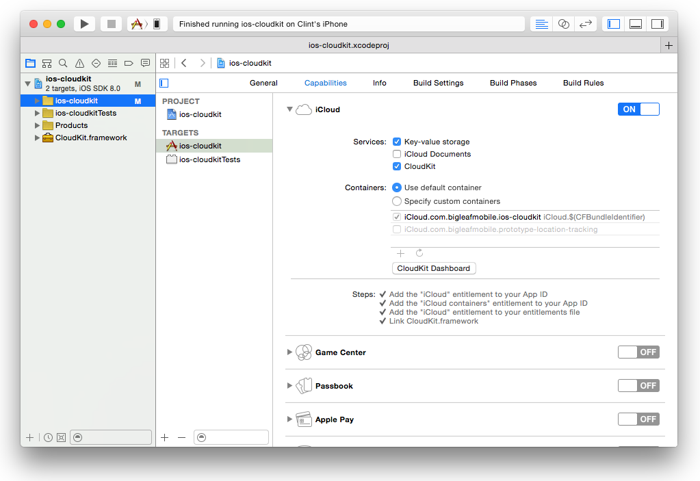

ios-cloudkit-objc
=================

#### Description
This repo simply contains sample code for using the CloudKit framework.

####Languages
Objective-C and Swift

####Sample Code

[How to __CREATE__ a new record in a Container's Public Database using Objective-C](https://gist.github.com/ccabanero/a4e3875439df4b97948f) 

[How to __CREATE__ a new record in a Container's Public Database using Swift](https://gist.github.com/ccabanero/17ded1cdaa68517bfb22) 

[How to __FETCH__ a record in a Container's Public Database with a known Record ID using Objective-C](https://gist.github.com/ccabanero/f83a8a0e3fd3d546c31f) 

[How to __FETCH__ a record in a Container's Public Database with a known Record ID using Swift](https://gist.github.com/ccabanero/838c1cfc48924f6b9eca) 

[How to __UPDATE__ a record in a Container's Public Database using Objective-C](https://gist.github.com/ccabanero/8a41a0ef181a12e9eb7c) 

[How to __UPDATE__ a record in a Container's Public Database using Swift](https://gist.github.com/ccabanero/7b238941efb69e0d891d) 

[How to __QUERY__ a record from a Container's Public Database with NSPredicate using Objective-C](https://gist.github.com/ccabanero/a78827f0fa13ac498a14) 

[How to __QUERY__ a record from a Container's Public Database with NSPredicate using Swift](https://gist.github.com/ccabanero/e0f72d1067ba69eb996a) 

####Setting Up Your Project

In Xcode, simply turn on the __iCloud capability__, check on CloudKit, and start writing code :)  

See screenshot below ...

####Launching the CloudKit Dashboard

In Xcode, under the __iCloud capability__ section, simply click on the CloudKit Dashboard button.  This will open the Dashboard in your web browser.  Alternatively, just go to https://icloud.developer.apple.com/dashboard and authenticate with your Developer Program credentials.  

All of your CloudKit containers between your different Apps are centrally managed here.  Use the top left drop-down list to switch between different App Containers.

See screenshot below ...

####Connect
* Twitter: [@clintcabanero](http://twitter.com/clintcabanero)
* GitHub: [ccabanero](http:///github.com/ccabanero)