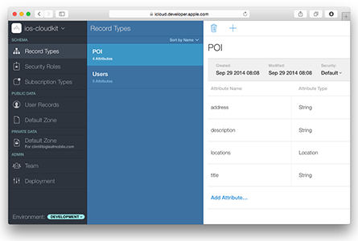

ios-cloudkit-objc
=================

#### Description
Sample code using the CloudKit framework.

####Language
Objective-C

####Sample Code

[How to create a new record in a CloudKit Container's Public Database](https://gist.github.com/ccabanero/a4e3875439df4b97948f) 

[How to fetch a record in a CloudKit Container's Public Database with a known Record ID](https://gist.github.com/ccabanero/f83a8a0e3fd3d546c31f)

[How to update a record in a CloudKit Container's Public Database](https://gist.github.com/ccabanero/8a41a0ef181a12e9eb7c)

[How to query a record from a CloudKit Container's Public Database Using NSPredicate](https://gist.github.com/ccabanero/a78827f0fa13ac498a14)

####Setting Up Your Project

In Xcode, simply turn on the __iCloud capability__, check on CloudKit, and start writing code :)  

See screenshot below ...

####Launching the CloudKit Dashboard

In Xcode, under the __iCloud capability__ section, simply click on the CloudKit Dashboard button.  This will open the Dashboard in your web browser.  Alternatively, just go to https://icloud.developer.apple.com/dashboard and authenticate with your iSO Developer Program credentials.  

See screenshot below ...

####Contact
* Twitter: [@clintcabanero](http://twitter.com/clintcabanero)
* GitHub: [ccabanero](http:///github.com/ccabanero)